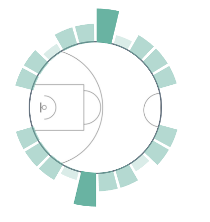

## D3_Vue_assembly

#### graph-2 是构建组件使用的vue-cli，可以直接运行查看输出结果，如下图：

#### 组件使用：

##### template为构建完成的文件夹，可以直接进行调用。

​	graph.vue 是1&2的组件

​		input：

​			data_time[] : number为10 的数组 

​			data_dif[] ： number为10的数组

​		output：外周的一整圈bar